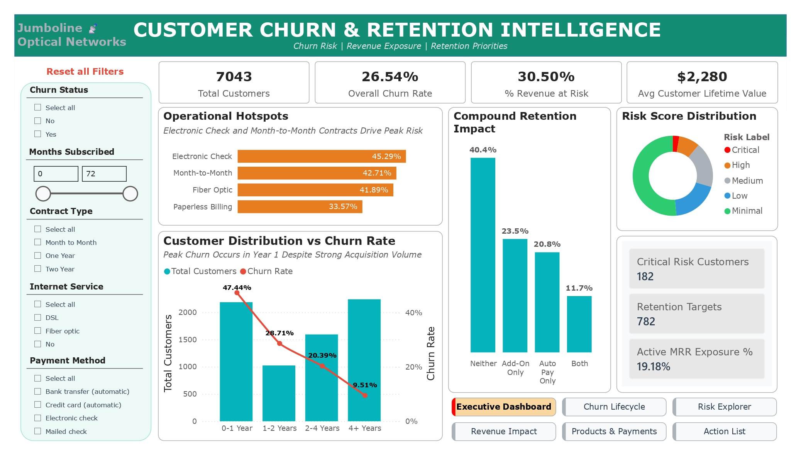
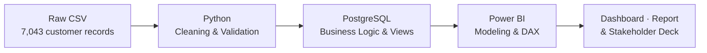
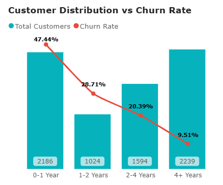
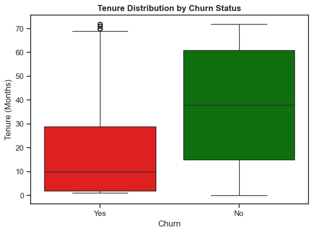

<div align="center">

# 📡 Jumboline Optical Networks — Customer Churn & Retention Intelligence

**A data-driven retention strategy for a telecom provider losing more than a quarter of its customers a year.**


</div>

---

## Table of Contents
1. [Client Background](#1-client-background)
2. [Executive Summary](#2-executive-summary)
3. [Project Overview & Objectives](#3-project-overview--objectives)
4. [Scope & Data Workflow](#4-scope--data-workflow)
5. [Metrics We Tracked](#5-metrics-we-tracked)
6. [Data Architecture](#6-data-architecture)
7. [Insights Deep-Dive](#7-insights-deep-dive)
8. [Recommendations](#8-recommendations)
9. [Assumptions & Limitations](#9-assumptions--limitations)
10. [Conclusion](#10-conclusion)
11. [Reproducing This Project](#11-reproducing-this-project)
12. [License & Author](#12-license--author)

---

## 1. Client Background

Jumboline Optical Networks is a regional internet, phone, and streaming-bundle provider positioned as a lower-cost challenger to national carriers. Its growth strategy has leaned on flexible, no-long-term-commitment plans and aggressive service bundling to win price-sensitive households away from larger competitors.

That strategy has worked for acquisition, new customer sign-ups have stayed healthy, but leadership has noticed something the acquisition numbers were masking: **recurring revenue growth has stalled**, even as marketing spend and new sign-ups continued climbing. The suspicion was churn, but nobody could yet say *which* customers were leaving, *when* in their lifecycle it was happening, or *how much* it was actually costing the business in dollar terms.

This analysis is directed to Jumboline's VP of Customer Retention. She commissioned it after a quarterly business review where acquisition metrics looked strong but net subscriber growth barely moved, a gap that only a churn-specific, customer-level analysis could explain. Her mandate for this project was to:
- Identify exactly where retention effort and budget will have the largest, most defensible financial return, and
- Give her team a live tool to act on it.

## 2. Executive Summary

<p align="center">
    
</p>

**1. Churn Is Material, Not Marginal**
- **26.5%** of Jumboline's 7,043 customers have churned, representing **$139,131 in monthly recurring revenue (30.5% of the total)** already lost.

**2. Risk Is Front-Loaded Into the First Year**
- Customers in their first year churn at **47.4%**, more than five times the rate of customers with 4+ years of tenure (9.5%). Whatever is driving churn, it overwhelmingly happens early.

**3. Four Individual Factors Carry the Highest Risk**
- Electronic check payment (45.3%), month-to-month contracts (42.7%), fiber optic internet (41.9%), and paperless billing (33.6%) are the four categorical attributes most strongly associated with elevated churn, and they compound: customers matching month-to-month contract + fiber optic internet + electronic check payment + tenure of 12 months or less have historically churned at **71.16%**.


**4. Retention Levers Work Better Together Than Alone**
- Customers with neither a protective add-on nor automatic payment churn at 40.4%. Customers with both churn at **11.7%**, evidence that a combined retention campaign outperforms either tactic run in isolation.

**5. There Is a Live, Actionable List Today**
- **182 currently active customers** match all four Risk Score factors right now. **782** match three or more, representing **19.18%** of active monthly recurring revenue sitting with customers who haven't churned yet, but show every warning sign that they will.

## 3. Project Overview & Objectives

**Context:** Jumboline's leadership needed to understand why subscriber growth had plateaued despite steady acquisition, and whether the cause was concentrated in specific, addressable customer segments.

**Problem Statement:** Which customers are most likely to churn, why, and how much revenue is realistically recoverable by acting on that information?

**Approach:** A full-pipeline analysis; Python for data cleaning and exploratory analysis, PostgreSQL for validated business logic and a reusable view layer, and Power BI for a live, interactive decision-support tool.

**Outcome:** A validated churn driver framework, a quantified financial exposure figure, a four-factor live risk-scoring system, and a six-page interactive dashboard the retention team can use for ongoing prioritization, not a one-time analysis that goes stale.

### Objectives
- **Primary Objective:** Identify the customer attributes most strongly associated with churn and quantify their combined financial impact.
- **Specific Objectives:**
    1. Build a reusable, live risk-scoring framework that flags currently active customers before they churn.
    2. Test whether retention levers compound or duplicate each other, so retention spend isn't wasted on redundant tactics.
    3. Package the findings into a dashboard the retention team can operate independently, without rerunning the analysis each quarter.

## 4. Scope & Data Workflow

| | |
|---|---|
| **In Scope** | All 7,043 residential customer accounts in the current snapshot; demographic, service, contract, billing, and churn status attributes. |
| **Out of Scope** | Acquisition cost, marketing channel data, customer service transcripts, and network performance logs, none were available in the source data, and each is called out below where it limits interpretation. |
| **Time Period** | Single point-in-time snapshot; tenure is measured in months from each customer's join date to the snapshot date. |
| **Granularity** | One row per customer. |

### Data Workflow



1. **Source:** Single CSV export, 7,043 rows, 21 attributes (demographics, services, contract, billing, churn flag).
2. **Ingestion:** Loaded into a Jupyter Notebook via pandas.
3. **Cleaning:** Standardized column naming, corrected a mistyped numeric field, fixed inconsistent boolean encoding, and normalized categorical labels.
4. **Transformation:** Engineered tenure bands, a service-adoption count, and a four-factor composite risk flag.
5. **Analysis:** Statistical (correlation, distribution comparison), SQL-based segmentation, and DAX-based live scoring.
6. **Output:** A validated PostgreSQL view layer feeding a six-page Power BI dashboard, a written report, a stakeholder presentation, and this document.

### Tools & Technologies
| Layer | Tools |
|---|---|
| Data Storage | PostgreSQL |
| Data Processing | Python (pandas, NumPy) |
| Analysis | Custom SQL, statistical correlation, DAX |
| Visualization | Matplotlib, Seaborn, Power BI |
| Version Control | Git / GitHub |
| Documentation | Markdown, MS Word, MS PowerPoint |

## 5. Metrics We Tracked

**Jumboline Retention Metrics**, the five lenses this analysis is organized around:

- **Churn & Lifecycle Trends** — overall churn rate, and how risk changes across a customer's tenure.
- **Service & Contract Risk** — which contract types, internet service, and payment methods carry disproportionate churn.
- **Revenue Exposure** — the dollar value already lost, and currently at stake, from churn.
- **Customer Risk Segmentation** — a live, four-factor score identifying which *active* customers are most exposed right now.
- **Retention Lever Effectiveness** — which interventions (protective add-ons, payment migration) actually move the churn rate, individually and combined.

## 6. Data Architecture

This analysis is built on a single, flat customer table, one row per customer, with no joins or unions required. Three PostgreSQL views sit on top of the cleaned table to serve the dashboard directly:

- **`vw_customer_analytics`** — row-level, the primary source Power BI connects to.
- **`vw_segment_churn_summary`** — segment-level rollups behind the Priority Matrix.
- **`vw_addon_impact`** — the retention-lever comparison behind Section 7.5.

## 7. Insights Deep-Dive

### 7.1 Churn & Lifecycle Trends

<p align="center">
  
  
</p>

- Churn rate falls sharply and consistently with tenure: **47.4%** (0–1 year) → 28.7% (1–2 years) → 20.4% (2–4 years) → **9.5%** (4+ years).
- Median tenure for churned customers is **~10 months**, versus **~38 months** for retained customers.
- Tenure is the single strongest statistical correlate of churn found anywhere in this analysis (r = −0.35), stronger than any individual service or billing attribute.

### 7.2 Service & Contract Risk

<p align="center">
  
</p>

- **Contract type:** month-to-month churns at 42.7%, roughly 4x the one-year rate (11.3%) and 15x the two-year rate (2.8%), the largest churn-rate range of any single factor in this analysis.
- **Internet service:** fiber optic churns at 41.9%, more than double DSL (19.0%), and the gap persists at every contract length.
- **Payment method:** electronic check churns at 45.3%, the highest individual churn rate of any category measured.
- **Household structure (secondary signal):** customers without a partner (33.0% vs. 19.7%) or without dependents (31.3% vs. 15.5%) churn more. Gender and phone service subscription show no meaningful effect and are excluded from targeting.

### 7.3 Revenue Exposure

<p align="center">
  
</p>

- **$139,131/month** (30.5% of total revenue) is tied to customers who have already churned.
- Customer lifetime value tells two different stories by contract length: Two Year churners are rare (48 customers) but high-value (≅$5,432 average lifetime value each); Month-to-Month churners are numerous (1,655 customers) but lower-value (≅$1,164 average each). **Month-to-month churn is a volume problem; long-contract churn is a value-protection problem**, and they call for different retention tactics.

### 7.4 Customer Risk Segmentation

<p align="center">
  
</p>

- A live, four-factor Risk Score (month-to-month contract, fiber optic internet, electronic check payment, tenure ≤ 12 months) is calculated only for currently active customers, so it functions as a forward-looking exposure list, not a historical description.
- **182 customers** match all four factors today (Critical). **782** match three or more (Retention Targets), representing **19.18%** of active monthly recurring revenue.
- Historically, customers who ever matched all four factors churned at **71.16%** (449 of 631), the same population the live score is built to catch *before* they reach that outcome.

### 7.5 Retention Lever Effectiveness

<p align="center">
  
  
</p>

- Two specific add-ons are each associated with roughly halving churn individually: **Online Security** (31.3% → 14.6%) and **Tech Support** (31.2% → 15.2%).
- The two strongest levers compound rather than duplicate: customers with **neither** a protective add-on nor automatic payment churn at **40.4%**; customers with **both** churn at **11.7%**, a result stronger than either lever alone (add-on only: 23.5%; automatic payment only: 20.8%).

## 8. Recommendations

| Priority | Recommendation | Based On | Suggested Owner |
|---|---|---|---|
| 🔴 High | Launch structured onboarding and proactive check-ins during months 0–12. | Section 7.1 — 47.4% first-year churn, 5x the long-tenure rate | Customer Success |
| 🔴 High | Contact the 182 Critical-risk customers directly; this list already exists and is ranked by revenue exposure. | Section 7.4 — Risk Score and Action List | Customer Retention |
| 🔴 High | Pair the Online Security / Tech Support upsell with an automatic payment migration offer in the same campaign, not as separate initiatives. | Section 7.5 — compounding lever effect (40.4% → 11.7%) | Retention & Marketing (joint) |
| 🟠 Medium | Design an incentive to migrate customers off month-to-month contracts toward one- or two-year terms. | Section 7.2 — contract length shows the largest churn-rate range of any single factor (42.7% → 2.8% across tiers) | Sales / Retention |
| 🟠 Medium | Audit the fiber optic customer experience (pricing, reliability, support ticket volume) directly; the churn gap versus DSL persists at every contract length. | Section 7.2 — fiber churn 41.9% vs. DSL 19.0% | Product & Network Operations |
| 🟠 Medium | Offer a switching incentive to move electronic check customers to automatic bank transfer or credit card. | Section 7.2 — electronic check churn 45.3%, the highest individual rate of any factor measured | Billing & Payments |
| 🟡 Exploratory | Build a differentiated, higher-touch retention motion for long-contract churners; rare but individually high-value. | Section 7.3 — Two Year churners average ~$5,432 in lifetime value | Finance / Retention (joint) |

## 9. Assumptions & Limitations

**Assumptions**
- Customer status reflects a single point-in-time snapshot; churn is treated as a final, observed outcome rather than a predicted probability.
- Categorical service and billing labels in the source data are accurate as provided; no independent verification against Jumboline's internal billing system was possible.
- The four-factor Risk Score's equal weighting (one point per factor) was accepted as a reasonable starting heuristic, not derived from a calibrated statistical model.

**Limitations**
- **No acquisition cost or marketing spend data.** Retention ROI in this analysis reflects revenue preserved, not net return after campaign cost, that comparison would require finance input this dataset doesn't include.
- **Cross-sectional dataset.** As a cross-sectional study, data was collected at a static instance rather than across successive time intervals. Consequently, time-dependent trends, seasonal effects, or temporal impacts (such as post-price-change churn behavior) cannot be evaluated.
- **Small sample sizes in some cells.** A few segment intersections (e.g., 48 Two Year contract churners) are too small to generalize from with high confidence; they're reported as directional, not conclusive.
- **Correlation, not causation.** Every driver in this report is an observed association. The recommendations are prioritization hypotheses, not proven causal levers, and should be validated with a controlled retention offer test before scaling budget against them.
- **Selection bias / reverse causality.** Being a cross-sectional observational dataset, the direction of causality between add-on adoption and customer retention cannot be definitively established. Highly loyal or low-risk customers may naturally self-select into purchasing add-on services (reverse causality), rather than add-ons directly driving retention. Consequently, while add-on usage serves as a strong targeting signal for retention efforts, controlled experimentation (A/B testing) is required before making causal claims or executing scaled rollouts.

## 10. Conclusion

Churn at Jumboline is not explained by any single attribute; it emerges from the intersection of contract flexibility, payment friction, and how early in the relationship a customer sits. Long-tenured customers and those on multi-year contracts are consistently the most stable, while newer, month-to-month, electronic-check customers carry the highest and most predictable risk.

The more important takeaway sits in Section 7.5: risk is not fixed. Two customers who look identical on paper end up with very different odds of leaving depending on whether they've adopted a protective service and how they pay, which means retention is something Jumboline can actively influence, not just forecast. Even a low-risk profile is not fully immune: fiber's elevated churn persists even among customers on long contracts, evidence that a strong contract alone does not fully offset a weaker service experience. The Risk Score and Action List built from this analysis exist to turn these findings into a repeatable weekly habit for the retention team, not a one-time report that goes stale.

## 11. Reproducing This Project

**Prerequisites:** Python 3.9+, PostgreSQL 13+, Power BI Desktop

1. **Set up the Python environment**
   ```
   pip install pandas numpy matplotlib seaborn sqlalchemy psycopg2-binary
   ```
2. **Set up PostgreSQL**
   ```
   createdb telco_churn_analysis
   ```
   Configure the connection used by the notebook (see the **Export to PostgreSQL** section in [customer churn python analysis](<python_notebook/customer_churn_python_analysis.ipynb>)).
3. **Run the notebook**: [customer churn python analysis](<python_notebook/customer_churn_python_analysis.ipynb>) top to bottom; cleans, validates, and loads the data into PostgreSQL.
4. **Run the SQL workflow**: [customer churn SQL analysis](<sql_script/customer_churn_sql_analysis.sql>) against the prepared database.
5. **Open the dashboard**: [customer churn Power BI report template](<power_bi_template/customer_churn_power_bi_template.pbix>), update the connection to your local database, and refresh.

**All deliverables:**

| Deliverable | Purpose |
|---|---|
|[Python Notebook](<python_notebook/customer_churn_python_analysis.ipynb>) |Data cleaning, validation and EDA
|[SQL Analysis](<sql_script/customer_churn_sql_analysis.sql>) |Structured analytical queries and business logic
|[Power BI Report](<power_bi_template/customer_churn_power_bi_template.pbix>) |Interactive decision-support dashboard
|[Power BI Report (PDF)](<reports/Power BI Report.pdf>) |Full dashboard export, all six pages in one document
|[Analytical Report](<reports/Analytical Report.pdf>) |Full technical methodology and findings
|[Stakeholder Presentation](<reports/Stakeholder Presentation.pdf>) |Executive communication of insights and recommendations

**Data Source:** [IBM Telco Customer Churn — Kaggle](https://www.kaggle.com/datasets/blastchar/telco-customer-churn) (7,043 records, 21 attributes)

## 12. License & Author

This project is licensed under the MIT License — see [LICENSE](LICENSE) for details.  

**Linda Nyakasi**  
Certified Data Analyst  
[LinkedIn](https://www.linkedin.com/in/linda-nyakasi) | [GitHub](https://github.com/Linda-Nyakasi)
